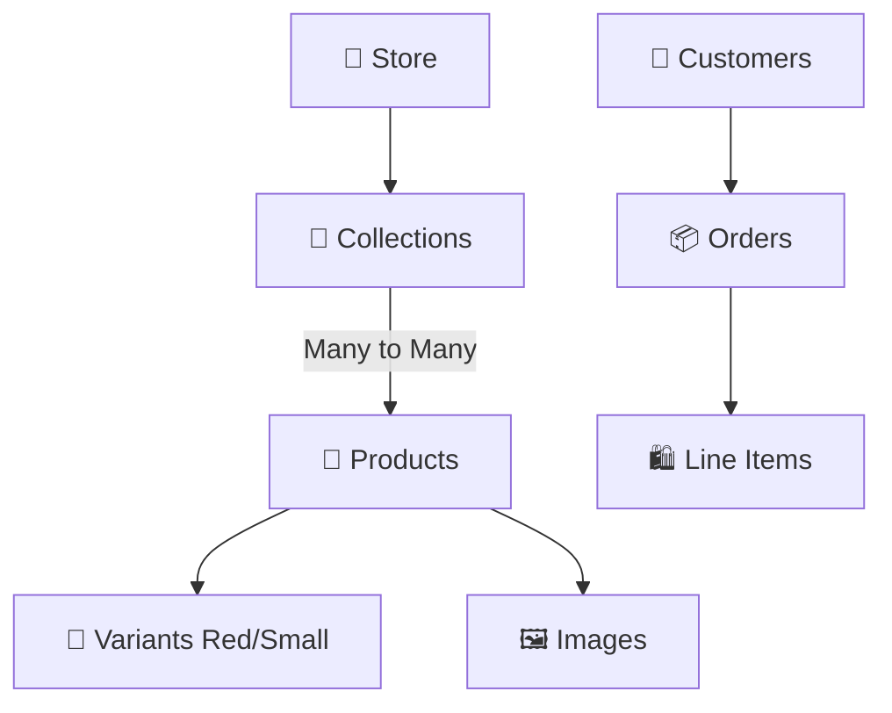

<div align="center">

# 🛍️ ✨ My Hydrogen Store ✨ 🛍️
### 🚀 Complete Architecture & Project Documentation 🚀

<p align="center">
  
  
  
  
  
  
</p>

> **🌟 Welcome!** Ye repository ek **headless e-commerce storefront** hai jo **Shopify Hydrogen** ka use karke banaya gaya hai. Ye document naye developers ko onboard karne aur project ka pura architecture step-by-step ekdum majedar tareeke se samajhne ke liye banaya gaya hai.

</div>

<br/>

---

## 📖 1. Project Overview

### 🎯 **Ye application kya karta hai:**
Ye ek headless e-commerce storefront hai jo Shopify Hydrogen ka use karke banaya gaya hai. Iska main kaam ye hai ki ye purane Shopify Liquid templates ko hata kar ek **custom** aur **highly performant** frontend deta hai.

### 💡 **Ye kaunsa business problem solve karta hai:**
Traditional e-commerce platforms mein developers ko template engines (Liquid) ki wajah se bahut restrictions face karni padti thi. Ye headless approach us problem ko solve karti hai. Isse page load times **super fast** hote hain *(edge computing aur React streaming SSR ke wajah se)* aur UI/UX bilkul apne hisab se custom banaya ja sakta hai.

### 👥 **Target users kaun hain:**
End-consumers (shoppers) jo ek fast aur smooth shopping experience chahte hain. Iske alawa store admins/developers iske secondary users hain.

### 🏗️ **Overall Architecture Flow Diagram:**

```graphql
# 🌀 User Request Journey
User (Browser) 
  ➡️ HTTP Requests / Navigation
   ⬇️
Edge Network (Shopify Oxygen / Cloudflare Workers - Yahan code run hota hai)
   ⬇️
Frontend/Backend Hybrid (React Router 7 Loaders & Actions)
   ⬇️ (GraphQL Queries / Mutations bhejte hain)
Shopify Storefront API & Customer Account API
   ⬇️
Shopify Core Database (Asli data yahan hai)
   ⬇️
Response (Streaming HTML + JSON user ko wapas milti hai)
```

<br/>

---

## 📂 2. Folder Structure Analysis

```bash
my-hydrogen-store/
├── 📁 app/
│   ├── 🎨 assets/        # Static assets jaise favicon aur images
│   ├── 🧩 components/    # Reusable React components (UI blocks)
│   ├── 📡 graphql/       # GraphQL fragments, mutations, aur queries
│   ├── 🛠️ lib/           # Utility functions, context, aur session management
│   ├── 🗺️ routes/        # React Router ka file-based routing system
│   ├── 💅 styles/        # Global CSS files (app.css, reset.css)
│   ├── 🚀 entry.client.jsx # Client-side React hydration ka entry point
│   ├── 🖥️ entry.server.jsx # Server-side React rendering ka entry point
│   └── 🌳 root.jsx       # Root component jo pure HTML shell ko define karta hai
├── 🌍 public/            # Public static files
├── 🔒 .env               # Local environment variables
├── 📦 package.json       # Project ki dependencies aur scripts
├── ⚙️ server.js          # Edge fetch event handler (Yehi backend hai)
└── ⚡ vite.config.js     # Vite bundler ki configuration
```

> **🔥 Pro Tip:**
> Har file ka ek specific kaam hai. UI blocks ke liye `components`, data fetching ke liye `routes`, aur API calls ke liye `graphql` folder use hota hai!

<br/>

---

## 🛠️ 3. Technology Stack Analysis

### ⚛️ Frontend
- **React 19:** UI banane ke liye use hua hai. Iske naye concurrent rendering features page ko smoothly render karte hain.
- **React Router 7:** Routing ke liye. Ye Remix framework ka updated roop hai jo backend API (`loaders`/`actions`) aur frontend UI ko ek sath handle karta hai.
- **Shopify Hydrogen:** Shopify ka special toolkit jisme readymade `<Image>` aur cart components milte hain.

### ☁️ Backend / Infrastructure
- **V8 Isolates:** Is app mein normal Node.js server nahi hai. Ye **Shopify Oxygen (Cloudflare Workers)** pe chalta hai, jahan requests milli-seconds mein process hoti hain!
- **Vite:** Next-generation frontend tooling jo development server aur bundling ko extremely fast banati hai.

### 💾 Database & APIs
- **Shopify Core Database:** Humara apna koi SQL ya MongoDB nahi hai. Pura data Shopify ke servers se aata hai.
- **GraphQL:** Data fetch karne ki smart language. Isse "over-fetching" nahi hoti (matlab jitna data maanga, utna hi milta hai).
- **Vanilla CSS:** Styling ke liye simple `app.css` use kiya gaya hai.

<br/>

---

## 📦 4. Dependency Analysis

| 📦 Package Name | 🔢 Version | 🎯 Purpose | 🚨 Critical? |
|-----------------|------------|------------|--------------|
| `@shopify/hydrogen` | `2026.4.4` | Core framework hooks aur components | ✅ Haan |
| `react` & `react-dom` | `^19.1.0` | UI render karne wala engine | ✅ Haan |
| `react-router` | `7.16.0` | Routing aur data fetch karne ka logic | ✅ Haan |
| `graphql` | `^16.10` | GraphQL queries ko samajhne ke liye | ✅ Haan |
| `vite` | `^6.3.5` | Code bundler aur dev server | ⚠️ Dev Only |
| `isbot` | `^5.1.22` | SEO ke liye Google bots detect karta hai | ❌ Nahi |

<br/>

---

## 🔌 5. API Analysis (Very Detailed)

Is project ki jaan **Shopify Storefront API** hai!

### 📥 Data Flow Kaise Hota Hai:
```javascript
Frontend React Component
       ⬇️ (loader function call hota hai)
context.storefront.query(GRAPHQL_QUERY)
       ⬇️
Shopify Storefront API (Backend)
       ⬇️
JSON Response
       ⬇️
React Component data screen pe dikhata hai 🚀
```

**Main APIs:**
1. **🛒 Storefront API:** Products aur Categories (Collections) laane ke liye.
2. **🔐 Customer Account API:** Login, purane orders, aur user profile dekhne ke liye.

<br/>

---

## 🗄️ 6. Database Analysis (ER Diagram)

Yahan database Shopify ka apna internal system hai:



<br/>

---

## 🛡️ 7. Authentication System

Isme password database mein save karne ka dard humara nahi hai. Sab kuch **OAuth-like flow** ke through Shopify handle karta hai.

**🔑 User Login Flow:**
1. User **Log in** button par click karta hai.
2. User ko Shopify ke secure page pe bheja jata hai.
3. User credentials daalta hai aur Shopify wapas humari app pe redirect karta hai.
4. Hum token capture karke ek **Secure HTTP-Only Cookie** (`app/lib/session.js`) mein save karte hain. Session locked! 🔒

<br/>

---

## 💼 8. Business Logic Analysis (Add to Cart)

**Sabse important journey: 🛒 Add to Cart**
1. User Product Page pe jata hai aur **Size/Color** select karta hai.
2. Jaise hi **"Add to Cart"** pe click hota hai, React Router ka `action` function trigger hota hai.
3. `context.cart.addLines()` call hoke backend update ho jata hai.
4. React Router **automatic** naya data (`loader` revalidation) mangwa leta hai.
5. UI bina reload hue turant update ho jati hai! ✨

<br/>

---

## 🏗️ 9. Frontend Architecture

**🧩 Component Hierarchy:**
```html
<App> <!-- root.jsx -->
  <AnalyticsProviders>
    <PageLayout>
      <Header /> <!-- Top Navbar -->
      <Outlet /> <!-- Ye badalta hai URL ke hisab se (Homepage ya Product) -->
      <Footer /> <!-- Bottom Section -->
    </PageLayout>
  </AnalyticsProviders>
</App>
```

> **💡 State Management Hack:** Isme Redux nahi hai! Saara data **React Router Loaders** handle karte hain. Data ekdum fresh aur synced rehta hai.

<br/>

---

## ⚙️ 10. Backend Architecture (Edge Compute)

Is app ka backend traditional Node.js nahi hai. Ye ek **Edge Worker** hai!

**🔄 Request Lifecycle:**
1. **Client:** Browser se request aayi.
2. **Edge Worker (`server.js`):** Request pakdi aur context setup kiya.
3. **React Router:** URL match kiya aur data mangwaya.
4. **SSR:** React HTML render karke user ko de deta hai ⚡.

<br/>

---

## 🚀 11. Performance Analysis

**🏆 Achhi Baatein:**
- **Streaming SSR:** Page ka header turant dikh jata hai, aur heavy data piche se load hoke aa jata hai (`<Suspense>` magic!).
- **Edge Deployment:** Code user ke pin-code ke sabse paas wale server se deliver hota hai. Super Fast!

**🔧 Optimizations (Future ideas):**
- Agar app badi hoti hai toh `TailwindCSS` integrate karna accha rahega.
- Footer ki images ko `loading="lazy"` dena chahiye.

<br/>

---

## 🔒 12. Security Analysis

- **API Secrets:** Private keys sirf server (`server.js`) mein rehti hain, browser me leak nahi hotin.
- **XSS:** React safely data render karta hai, toh Cross-Site Scripting ka tension kam hai.
- 🔴 **Action Item:** Local `.env` mein `SESSION_SECRET="foobar"` hai. Production deploy se pehle ise **Strong Password** se replace zaroor karein!

<br/>

---

## ☁️ 13. Deployment

Ye project **Shopify Oxygen** par deploy hota hai.
- **Servers:** AWS ya Docker ki koi tension nahi. Shopify Oxygen sab khud sambhalta hai.
- **Process:** Jab git pe code push hota hai, Vite app ko compress karke worker script banata hai, aur wo turant live ho jati hai.

<br/>

---

<div align="center">

## 🎤 14. 30 Interview Questions & Answers
### (Naye Developers Ke Liye Must-Read)

</div>

<details>
<summary><b>🔥 Click Here to View All 30 Interview Questions!</b></summary>

<br>

**1. Shopify Hydrogen kya hai?**
*Answer:* Ye ek headless commerce framework hai jo React par based hai. Ise Shopify ne banaya hai taaki developers custom storefronts fast aur asani se bana sakein.

**2. Is project mein Express server kyun nahi hai?**
*Answer:* Kyunki ye app Edge compute (Shopify Oxygen) pe chalti hai jahan ek long-running Node server ki jagah fetch event listeners (V8 workers) request ko handle karte hain.

**3. React Router 7 mein data fetch kaise hota hai?**
*Answer:* Har route ke andar ek `loader` function hota hai. Wo function server pe chalta hai aur data la kar component ko `useLoaderData` hook ke through de deta hai.

**4. `server.js` ka kya kaam hai?**
*Answer:* Ye application ka entry point hai. Har incoming request pehle isme aati hai, aur ye us request ko React Router aur Hydrogen Context ko pass kar deta hai.

**5. Cart aur UI ke beech state kaise sync hoti hai bina Redux ke?**
*Answer:* Jab cart update karne ke liye `action` chalta hai (jaise item add karna), toh React Router automatic route ke `loader` ko dubara call kar leta hai. Naya data aate hi UI refresh ho jata hai.

**6. `loadCriticalData` aur `loadDeferredData` mein kya farq hai `root.jsx` mein?**
*Answer:* Critical data (jaise Header menu) page render hone se pehle aata hai, jabki Deferred data (jaise Footer ya reviews) page load hone ke baad asychronously load hota hai, isse user ko site jaldi dikhni start ho jati hai.

**7. App mein TailwindCSS kyun nahi dikh raha?**
*Answer:* Default Hydrogen scaffold mein plain `app.css` aur CSS variables use kiye jate hain taaki shuruati setup complex na ho. Ise baad mein Tailwind se asani se replace kar sakte hain.

**8. Customer Account API, Storefront API se alag kaise hai?**
*Answer:* Storefront API mainly public data (jaise products, collections) aur anonymous carts ke liye hai. Customer API private authenticated data jaise user profile aur previous orders dekhne ke liye hoti hai.

**9. Shopify Oxygen kya hai?**
*Answer:* Oxygen ek global edge-hosting platform hai jo Shopify ne specially Hydrogen storefronts chalane ke liye banaya hai (Cloudflare Workers technology pe).

**10. App ko SQL Injection se kaise bachaya gaya hai?**
*Answer:* App directly kisi database se connect nahi karta. Ye sirf Shopify ki GraphQL API se baat karta hai jahan injection attacks possible nahi hain.

**11. `package.json` mein `isbot` library kya kaam karti hai?**
*Answer:* Ye check karti hai ki visitor human hai ya search engine ka bot (Googlebot). Agar bot hai, toh app streaming ki jagah pura page server se render karke bhejta hai taaki SEO accha ho.

**12. User Session kahan store hota hai?**
*Answer:* Session ka data encrypt ho kar ek HTTP-only secure cookie mein save ho jata hai jo browser mein browser band hone tak rehta hai.

**13. `SESSION_SECRET` .env mein kyun zaroori hai?**
*Answer:* Us secret key se user ki session cookie cryptographically sign hoti hai. Isse koi hacker cookie manipulate karke fake login nahi kar sakta.

**14. GraphQL Fragments kya hote hain?**
*Answer:* Ek hi chiz (jaise Product card ka image, title, price) jab baar-baar alag queries mein mangani ho, toh hum ek Fragment bana lete hain aur use reuse karte hain (jaise `CART_QUERY_FRAGMENT`).

**15. Headless architecture website ko fast kaise banata hai?**
*Answer:* Frontend (React) aur Backend (Shopify Liquid) alag hone se hum frontend ko Cloudflare Edge pe duniya bhar mein deploy kar dete hain. Isse server load time kam ho jata hai aur UI transitions smooth rehti hain.

**16. `shopify hydrogen codegen` command kya karti hai?**
*Answer:* Ye command aapki code file mein likhi GraphQL queries ko padhti hai aur automatically unke TypeScript types generate karti hai, taaki baad mein autocomplete aur error checking mile.

**17. React Router mein `<Outlet />` kya hota hai?**
*Answer:* Ye parent component mein ek placeholder jagah hoti hai, jahan child components (URL ke hisaab se) inject kiye jate hain. (Jaise layout ke andar page dalna).

**18. Analytics add karna ho toh kahan karenge?**
*Answer:* `root.jsx` mein `<head>` tag ke andar script daal sakte hain, ya phir Hydrogen ka in-built `<Analytics.Provider>` use karke tracking events dispatch kar sakte hain.

**19. Agar Shopify ka API server down ho jaye toh app crash hoga kya?**
*Answer:* App poora crash nahi hoga. React Router error catch karke `ErrorBoundary` component dikha dega, jahan user ko "Oops, something went wrong" ka message aayega.

**20. Webpack ki jagah Vite kyun use kiya?**
*Answer:* Vite Native ES Modules ka use karta hai jiski wajah se development server mili-seconds mein start hota hai aur page reload bina delay ke ho jata hai.

**21. Predictive Search (search as you type) kaise chal raha hai?**
*Answer:* Jab bhi user input box mein type karta hai, `action` ke through backend ko request jati hai aur GraphQL API instantly matching products suggest karti hai.

**22. Environment variables ko code me kaise use kar rahe hain?**
*Answer:* Edge environment mein `process.env` kaam nahi karta. Variable directly request object mein milte hain, isliye inhe `context.env` ke through access kiya jata hai.

**23. React mein Hydration ka kya matlab hai?**
*Answer:* Server jo plain HTML browser ko bhejta hai, uspe React load hone ke baad event listeners (jaise click, hover) attach karta hai taaki website interactive ban jaye. Is process ko Hydration kehte hain.

**24. Isme SEO (Meta tags) kaise handle kiya gaya hai?**
*Answer:* Har page file (route) ke andar ek `meta` function likha jata hai, jo title, description aur open graph tags dynamically create karta hai.

**25. `reset.css` ki kya zaroorat padi?**
*Answer:* Har browser (Chrome, Safari) apna ek default style lagata hai jo thoda alag hota hai. `reset.css` sab kuch neutralize kar deta hai taaki design sab browsers pe same dikhe.

**26. Pagination kaise handle kiya gaya hai yahan?**
*Answer:* Cursor-based pagination use ki hai, jisme `pageInfo` aur `cursor` (string) pass kiye jate hain taaki next page ke items load kiye ja sake. Isse performance better hoti hai normal offset-pagination ke compare mein.

**27. Route `Loader` aur `Action` mein difference kya hai?**
*Answer:* `Loader` GET requests handle karta hai (sirf data display karne ke liye lata hai). `Action` POST/PUT/DELETE requests handle karta hai (data modify karne ke liye).

**28. Caching kaise kaam kar rahi hai?**
*Answer:* `storefront.CacheLong()` jaisi properties se Hydrogen GraphQL requests ko Shopify edge nodes pe hi cache kar leta hai.

**29. Environment Variables ke aage `PUBLIC_` kyun lagaya hai?**
*Answer:* Ye ek convention (niyam) hai jo batata hai ki ye variables browser side javascript mein leak ho jayein toh koi tension nahi hai, ye secure variables (keys) nahi hain.

**30. Agar iss project ko Tailwind CSS par migrate karna ho toh kya steps honge?**
*Answer:* Sabse pehle npm se `tailwindcss`, `postcss`, `autoprefixer` install karenge. Phir `tailwind.config.js` generate karenge, `app.css` mein Tailwind directives (`@tailwind base;` etc.) daalenge aur fir normal CSS hata kar classes ko `className="text-center font-bold"` format mein likhna shuru karenge.

</details>

<br/>

<div align="center">
  <h3>🎉 Thanks for checking out the documentation! 🎉</h3>
  <p>Happy Coding! 💻✨</p>
</div>
